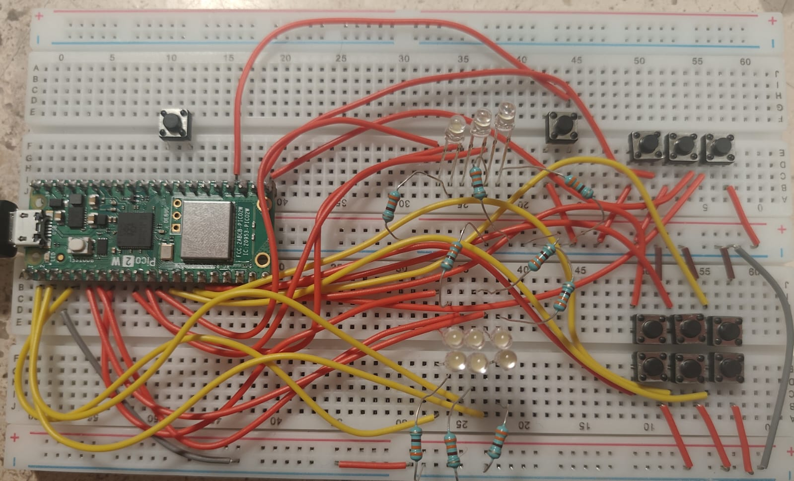
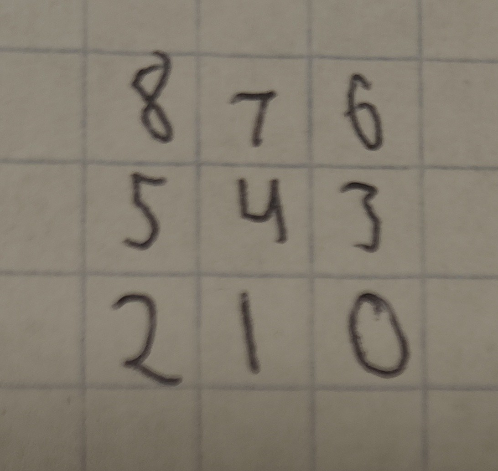

# Blackout 3×3

## Exam 1 — GPIO, boolean bit-packing and a hardware interrupt on a 3×3 grid

**Goal (one sentence):** Build a complete "lights-out" puzzle on a 3×3 grid of LEDs and buttons on the Pico 2 W — every GPIO explicitly configured, the whole board packed into one bit-packed integer touched only with bitwise operators, a hand-written RNG seeded from the hardware ring oscillator, and a restart button served by a hardware interrupt that works from any game state, including mid-victory.

---

### Setup

| Signal | GPIO | Direction | Pull | Notes |
|---|---|---|---|---|
| LED bits 0–8 (`LED_BASE = 0`) | GP0–GP8 | output | none — `gpio_disable_pulls()` | 1 GPIO per LED. Position = bit index, row-major: bit 8 = top-left … bit 0 = bottom-right, as seen from the front in the setup image. |
| Grid button bits 0–8 (`BTN_BASE = 9`) | GP9–GP17 | input | pull-up — `gpio_pull_up()` | Same position mapping as the LEDs. Pull-up means a press reads `0` |
| Restart button (`RESTART_BTN`) | GP18 | input | pull-up | Not part of the 3×3 grid. Served by a falling-edge hardware interrupt, not polled (R5) |

19 GPIOs total, all initialized together with `gpio_init_mask(led_mask | btn_mask)` and then split into outputs/inputs with `sio_hw->gpio_oe_set` / `gpio_oe_clr` — every line gets an explicit direction and pull in `setup_hardware()`, nothing is left at the reset default (R1). Each LED has a current-limiting resistor in series, sized for 3.3 V logic.


*Pico 2 W with the 3×3 LED grid, the 3×3 button grid, and the separate restart button.*

**Non-default:** the only external library linked besides `pico_stdlib` is `hardware_rosc`, added on purpose so the code can read `rosc_hw->randombit` directly:

```cmake
target_link_libraries(exam1
        pico_stdlib
        hardware_rosc
        )
```

R6 bans a library RNG, so the board seed can't come from anything like `rand()`. Instead, `setup_hardware()` samples the ring oscillator's `randombit` 32 times (one `delay_cycles(100)` apart) to build a 32-bit seed, then feeds that into a hand-written `xorshift32` for every board draw afterwards — the ROSC is only ever used once, to seed the shift register, not on every random number.


*Quick reference I sketched to check physical position against bit index while wiring*

### What I did

1. Wired 9 LEDs (GP0–GP8, current-limiting resistors) and 9 grid buttons + 1 restart button (GP9–GP18, internal pull-ups) on the breadboard.
2. Packed the 3×3 board into one `volatile uint32_t board_state`, and hand-derived the 9 plus-shaped `TOGGLE_MASKS[]` (one XOR mask per button, clipped at the edges).
3. Wrote `custom_xorshift32()` and seeded it bit-by-bit from `rosc_hw->randombit`; `generate_new_board()` applies 15 random masks and rejects boards that come out already-solved or solvable in one move.
4. Registered a falling-edge interrupt on the restart button (`gpio_set_irq_enabled_with_callback`) that regenerates the board and clears `victory_state` from `restart_isr()`.
5. Polled the 9 grid buttons each loop with a one-shot flag per button plus a fixed-cycle debounce (`delay_cycles(300000)`), and declared victory as soon as `board_state == 0`, blinking all 9 LEDs with `gpio_togl` while ignoring grid input.

### Demo — full game running

<video controls width="360">
  <source src="../../img/exam1_demo.mp4" type="video/mp4">
</video>

*Random board on power-up, a few moves showing the plus-shaped toggle (center, edge and corner), a mid-game restart via the interrupt button, and the win animation.*

---

### G1 — Control the display

Each LED is an independent output on GP0–GP8; `update_display()` clears the whole 9-bit mask with `sio_hw->gpio_clr` and re-sets it from `board_state << LED_BASE` in one write. Physical position matches the bit order in the sketch above — that mapping is what makes `TOGGLE_MASKS[]` correct in the first place.

### G2 — Read the nine buttons reliably

Each button is read straight off `sio_hw->gpio_in`, masked to its own bit — pull-up means "pressed" is a `0`:

```c
uint32_t btn_bit = 1u << (BTN_BASE + i);
bool is_pressed = ((sio_hw->gpio_in & btn_bit) == 0);
```

A `btn_flags[9]` array (one flag per button, not board state — R2 only applies to the board itself) makes each press register exactly once: the flag goes up after a debounce confirms the press, and only comes back down after a second debounce confirms release, so holding a button doesn't repeat the move and two buttons held at once don't interfere with each other.

### G3 — The plus-shaped toggle

This is where the wiring mistake below showed up first. `TOGGLE_MASKS[i]` is precomputed per position instead of chasing neighbors at runtime:

```c
const uint32_t TOGGLE_MASKS[9] = {
    0x00B, 0x017, 0x026, 
    0x059, 0x0BA, 0x134,
    0x0C8, 0x1D0, 0x1A0,
};
// applying a move is one line:
board_state ^= TOGGLE_MASKS[i];
```

Corners flip 3 bits, edges flip 4, the center flips 5 — the mask itself is what clips the pattern at the border, so there's no boundary `if` anywhere in the move logic (R3).

### G4 — Random starting board

`generate_new_board()` XORs 15 random masks onto an empty board, then checks the result isn't `0` and isn't equal to any single `TOGGLE_MASKS[i]` (a one-move win) before accepting it — every generated board is reachable from empty in at most 15 moves, which also proves it's always solvable in reverse. Two consecutive restarts land on different boards because each restart re-draws from `custom_xorshift32()`, which never resets — only the initial seed came from the ROSC.

### G5 — Restart by interrupt

```c
void restart_isr(uint gpio, uint32_t events) {
    if ((gpio == RESTART_BTN) && (events & GPIO_IRQ_EDGE_FALL)) {
        generate_new_board();
        update_display();
        victory_state = false;
    }
    gpio_acknowledge_irq(gpio, events);
}
```

Registered once in `setup_hardware()` with `gpio_set_irq_enabled_with_callback(RESTART_BTN, GPIO_IRQ_EDGE_FALL, true, &restart_isr)`. Because it writes `board_state` and `victory_state` directly instead of setting a flag for the main loop to notice later, a restart takes effect immediately no matter what the main loop was doing — including mid-victory-blink (G6/R8).

### G6 — Victory condition

`board_state == 0` is checked once per main-loop pass, right after the button-handling block, so victory is flagged the same loop iteration the last LED goes out — no extra press needed. Once `victory_state` is true, the loop's top `if` skips the whole button-reading block and just toggles all 9 LEDs with `sio_hw->gpio_togl`, so grid presses can't change the board anymore and the blink can't be mistaken for a normal board.

---

### What went wrong

On the first wiring pass, the LED legs went into the wrong GPIO columns relative to the bit-position sketch above — physically closer to a mirrored layout than the row-major, top-left-is-bit-8 order the code assumes.

### Open question

- `update_display()` clears and re-sets the full 9-bit LED mask on every button press, even though only 3–5 bits actually change. The victory blink already uses `sio_hw->gpio_togl` on the full mask — could a press instead do `sio_hw->gpio_togl = TOGGLE_MASKS[i] << LED_BASE` and skip touching the bits that don't change?