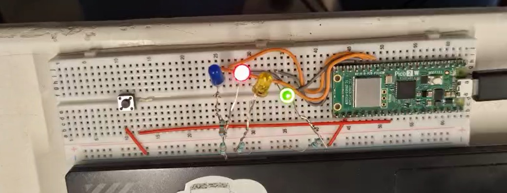

# GPIO Control — Outputs

## Session 3 — Register-Level vs SDK GPIO Timing

**Goal (one sentence):** Compare the execution time between register-level instructions and SDK instructions.

**Prediction — written *before* running anything:** Assuming the SDK instruction takes 2 cycles and the register-level instruction takes 1 cycle (for example), I expect the frequency of the SDK instructions to be half the frequency of the register-level instructions.

---

### Setup

- Pin map: GP18 → LED output; scope CH1 probe on GP18
- Photo of setup: 
- Non-default: nothing.

### What I did

1. New project from "Blink" template in the VS Code Pico extension, board = Pico 2.
2. Run SDK instructions.
3. Use the oscilloscope to measure the frequency.
4. Change the SDK instructions to register-level instructions and run the code.
5. Use the oscilloscope to measure the frequency.

### Evidence

| #  | File | What it shows | Cursor/measured value |
| --- | ---- | -------------- | ---------------------- |
| E1 |  | SDK version frequency measurement | 792.4 Hz |
| E2 |  | Register-level version frequency measurement | 1.317 kHz |

### Predicted vs measured

| Quantity | Predicted | Measured (evidence #) | Error % | Why the difference? |
| -------- | --------- | ---------------------- | ------- | -------------------- |
| SDK : register-level frequency ratio | 1 : 2 | 1 : 1.66 (E1, E2) | ~20 % | The difference between SDK and register-level frequency was smaller than expected. |

### Code

SDK version:

```c
gpio_init(LED);
gpio_set_dir(LED, GPIO_OUT);

while (true) {
    gpio_put(LED, 1);
    gpio_put(LED, 0);
}
```

Register-level version:

```c
const uint32_t LED_MASK = 1u << LED;

gpio_init(LED);
sio_hw->gpio_oe_set = LED_MASK;

while (true) {
    sio_hw->gpio_set = LED_MASK;
    sio_hw->gpio_clr = LED_MASK;
}
```

### What went wrong

- Forgot to include `sio_hw->gpio_oe_set = LED_MASK;` in the register-level version the first time.


---

## Session 4 — GPIO Bit-Pattern Animations (4-bit LED Bus)

**Goal (one sentence):** Drive four LEDs as a 4-bit register-level GPIO bus and reproduce four classic bit-pattern animations (binary counter, bouncing light, fill/empty, fill from the outside inward).

Exercises taken from [GPIO Control — Embedded Systems I (LIIE1214)](https://gulden8ag.github.io/embedded1/Bloque1-GPIO/Tema_C_GPIO_Control_revised/#9-comparing-abstraction-layers).

### Setup

- Pin map: GP10 → PIN_D, GP11 → PIN_C, GP12 → PIN_B, GP13 → PIN_A (4-bit bus, one LED + resistor per pin); pushbutton on the breadboard for reset.
- Photo of setup: 
- Non-default: nothing — same breadboard/board as Session 3, LEDs added on GP10–GP13.

### What I did

1. Wired four LEDs (each with a series resistor) to GP10–GP13 on the same breadboard used in Session 3.
2. Reused the register-level configuration validated in Session 3 (`gpio_init` per pin + a single `sio_hw->gpio_oe_set` with a 4-bit mask) instead of the SDK calls.
3. Wrote one small program per exercise, changing only the animation logic inside `while (true)`.
4. Recorded each animation on video as evidence (table below, per exercise).

**Shared setup code** (identical in all four exercises — only the loop body changes):

```c
#define PIN_A 13
#define PIN_B 12
#define PIN_C 11
#define PIN_D 10

const uint32_t MASK =
    (1u << PIN_A) | (1u << PIN_B) | (1u << PIN_C) | (1u << PIN_D);

gpio_init(PIN_A);
gpio_init(PIN_B);
gpio_init(PIN_C);
gpio_init(PIN_D);

sio_hw->gpio_oe_set = MASK;   // OE = Output Enable
```

### Exercise 1 — 4-bit binary counter

Use the four LEDs as a 4-bit binary number and count from 0 to 15 on repeat, one LED pattern per count. (Reflective question from the guide: does the CPU know whether you wrote the value in decimal, hexadecimal, or binary? No — by the time it reaches the register it's just 4 bits.)

```c
int counter = 0;

while (true) {
    sio_hw->gpio_clr = MASK;
    sio_hw->gpio_set = (counter << 10);
    sleep_ms(500);

    counter++;
    if (counter > 15) {
        counter = 0;
        sleep_ms(1000);
    }
}
```

<video controls width="360">
  <source src="../../img/s4_ex1_counter.mp4" type="video/mp4">
</video>

### Exercise 2 — Bouncing light

Move the lit LED across the four positions and back: `0001 → 0010 → 0100 → 1000 → 0100 → 0010 → 0001`, repeating.

```c
int counter = 0;

while (true) {
    sio_hw->gpio_clr = MASK;
    sio_hw->gpio_set = (1u << (counter + 10));
    sleep_ms(500);

    counter++;
    if (counter > 3) {
        while (counter > 0) {
            counter--,
            sio_hw->gpio_clr = MASK;
            sio_hw->gpio_set = (1u << (counter + 10));
            sleep_ms(500);
        }
    }
}
```

<video controls width="360">
  <source src="../../img/s4_ex2_bouncing_light.mp4" type="video/mp4">
</video>

### Exercise 3 — Fill and empty animation

Turn LEDs on one by one from right to left, then off again, using `gpio_togl` on a single moving bit.

```c
int counter = 0;

while (true) {
    sio_hw->gpio_togl = (1u << (counter + 10));
    sleep_ms(500);

    counter++;
    if (counter > 3) {
        counter = 0;
    }
}
```

<video controls width="360">
  <source src="../../img/s4_ex3_fill_empty.mp4" type="video/mp4">
</video>

### Exercise 4 — Fill from the outside inward

Light the two outer LEDs (PIN_A and PIN_D) first, then the two inner ones (PIN_B and PIN_C), toggling both edges of the bus symmetrically each step.

```c
int counter = 0;

while (true) {
    sio_hw->gpio_togl = (1u << (counter + 10));
    sio_hw->gpio_togl = (1u << (13 - counter));
    sleep_ms(500);

    counter++;
    if (counter > 1) {
        counter = 0;
    }
}
```

<video controls width="360">
  <source src="../../img/s4_ex4_fill_out_in.mp4" type="video/mp4">
</video>

### What went wrong

- **Exercise 2:** the first version had `counter--,` (comma) instead of `counter--;` (semicolon) inside the reverse loop. It still compiled and ran correctly — the comma operator just chains the expression into the next line — but it was luck, not intent; a stray comma elsewhere could easily change behavior silently.


### Open question

- Check the correct use of the `>>` shift operator instead of `<<`.
