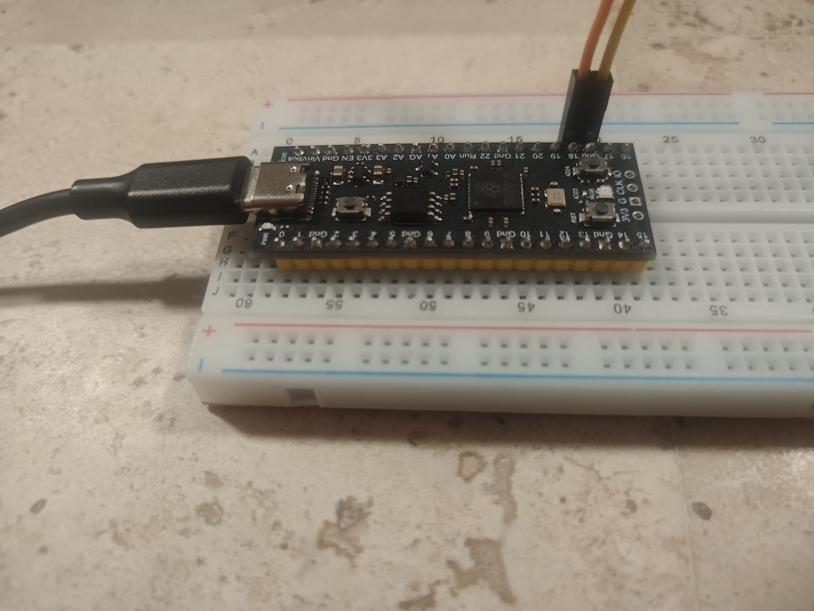
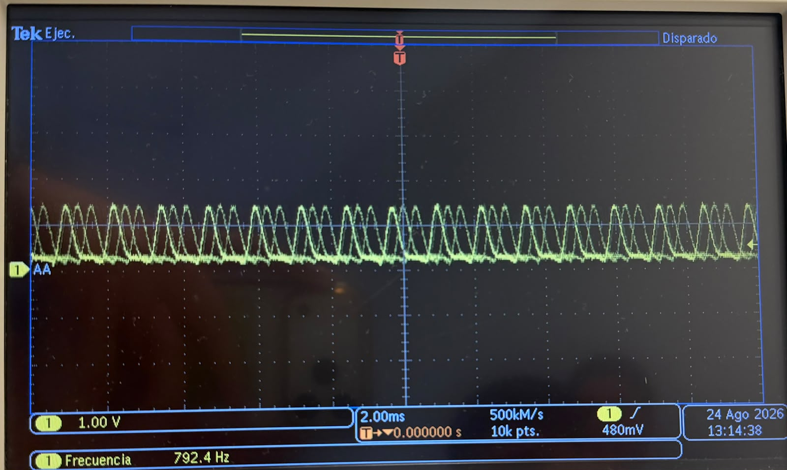
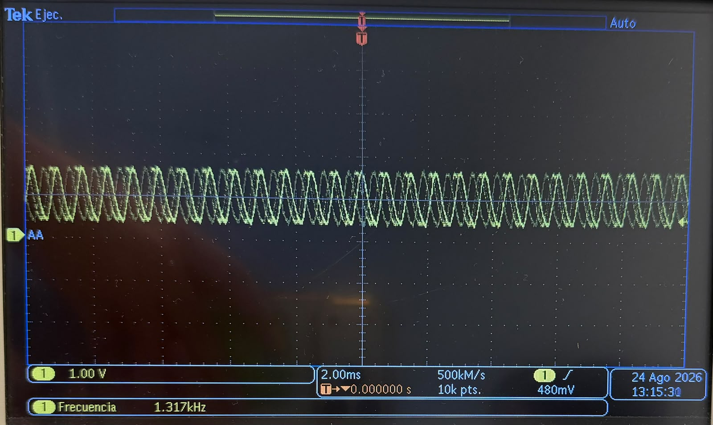

# Session 3 — Register-Level vs SDK GPIO Timing

**Goal (one sentence):** Compare the execution time between register-level instructions and SDK instructions.

**Prediction — written *before* running anything:** Assuming the SDK instruction takes 2 cycles and the register-level instruction takes 1 cycle (for example), I expect the frequency of the SDK instructions to be half the frequency of the register-level instructions.

---

## Setup

- Pin map: GP18 → LED output; scope CH1 probe on GP18
- Photo of setup: 
- Non-default: nothing.

## What I did

1. New project from "Blink" template in the VS Code Pico extension, board = Pico 2.
2. Run SDK instructions.
3. Use the oscilloscope to measure the frequency.
4. Change the SDK instructions to register-level instructions and run the code.
5. Use the oscilloscope to measure the frequency.

## Evidence

| #  | File | What it shows | Cursor/measured value |
| --- | ---- | -------------- | ---------------------- |
| E1 |  | SDK version frequency measurement | 792.4 Hz |
| E2 |  | Register-level version frequency measurement | 1.317 kHz |

## Predicted vs measured

| Quantity | Predicted | Measured (evidence #) | Error % | Why the difference? |
| -------- | --------- | ---------------------- | ------- | -------------------- |
| SDK : register-level frequency ratio | 1 : 2 | 1 : 1.66 (E1, E2) | ~20 % | The difference between SDK and register-level frequency was smaller than expected. |

## What went wrong

- Forgot to include `sio_hw->gpio_oe_set = LED_MASK;` in the register-level version the first time.

## Code

SDK version:

```c
gpio_init(LED);
gpio_set_dir(LED, GPIO_OUT);

while (true) {
    gpio_put(LED, 1);
    gpio_put(LED, 0);
}
```

Register-level version:

```c
const uint32_t LED_MASK = 1u << LED;

gpio_init(LED);
sio_hw->gpio_oe_set = LED_MASK;

while (true) {
    sio_hw->gpio_set = LED_MASK;
    sio_hw->gpio_clr = LED_MASK;
}
```

## Open question

- Check the correct use of the `>>` shift operator instead of `<<`.
