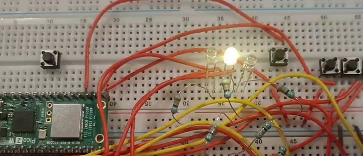

# Session 8 — Interrupt-Driven LED Roulette (Speed Control + Center Stop)

**Goal (one sentence):** Drive a 5-LED "roulette" light chaser from the SIO registers and control its speed, and its stop condition, with three push-button GPIO interrupts instead of polling.

---

## Setup

- Pin map: `PIN_A`=GP8, `PIN_B`=GP7, `PIN_C`=GP6, `PIN_D`=GP5, `PIN_E`=GP4 → 5 LEDs (with series resistors) forming the roulette; `PIN_BA`=GP16 (speed up / harder), `PIN_BB`=GP17 (slow down / easier), `PIN_BC`=GP18 (stop, only counts on the center LED).
- Photo of the breadboard: 
- Non-default: internal pull-ups enabled on `PIN_BA`, `PIN_BB`, `PIN_BC` (`gpio_pull_up`), so all three buttons are active-low and the ISR fires on `GPIO_IRQ_EDGE_FALL`. LEDs are driven directly through `sio_hw` (no `gpio_put`). Default 150 MHz `clk_sys`, nothing else changed.

## What I did

1. Wired the 5 LEDs (with resistors) to GP4–GP8 and the 3 push buttons to GP16–GP18 with internal pull-ups.
2. Wrote the chase loop with `sio_hw->gpio_set` / `gpio_clr`, bouncing `counter` from 0 up to 4 and back down so the lit LED sweeps E→A→E instead of just wrapping around.
3. Registered the interrupt callback once, on `PIN_BA`, with `gpio_set_irq_enabled_with_callback`, then enabled `PIN_BB` and `PIN_BC` with plain `gpio_set_irq_enabled` (all three share the same ISR).
4. Inside the ISR: `PIN_BA` decreases `speed` (floor 100 ms), `PIN_BB` increases it, and `PIN_BC` — only when `counter == 2` — clears every LED and calls a blocking blink routine.
5. Flashed the board, tested each button by hand, and recorded a short demo (audio removed): `img/s08_roulette_demo.mp4`.

---

## Evidence

| #  | File | What it shows | |
| --- | --- | --- | --- |
| E1 | `img/s08_roulette_demo.mp4` | Chase running at default speed (~0:00), then visibly faster after pressing the speed-up button a few times (~0:06–0:09) and then slower after pressing the speed-down button (~0:09-0:12) | Confirms `speed` actually changes on a button press |
| E2 | `img/s08_roulette_demo.mp4` | Right near the end of the clip (~0:16.8 s), all 5 LEDs turn off together while the lit LED (the middle one) start to blink | Confirms the winning condition|

<video controls muted width="100%" src="../../img/s08_roulette_demo.mp4"></video>

## What went wrong

- **Callback overwritten:** I called `gpio_set_irq_enabled_with_callback` once per button (once for `PIN_BA`, once for `PIN_BB`, once for `PIN_BC`), assuming each call attached its own handler. It doesn't — that function sets one shared callback per core, so each new call silently replaced the previous one and only the last button actually worked. Fix: call `gpio_set_irq_enabled_with_callback` once (on `PIN_BA`) and use plain `gpio_set_irq_enabled` for `PIN_BB` and `PIN_BC`, since all three land in the same `gpio_isr` anyway.
- **`static` instead of `volatile`:** `speed` and `counter` were first declared `static`. The main loop kept reading a stale value because the compiler had no reason to think the ISR could change them between reads. Switching both to `volatile` fixed it.
- **`sleep_ms` inside the ISR:** the first version of the "stop" blink called `sleep_ms()` from inside `gpio_isr`, which froze the whole program — `sleep_ms` waits on the timer/event system, and calling it from interrupt context stalled everything instead of just pausing. Replaced it with `busy_wait_ms` inside `blink_blocking`, so the ISR blocks the CPU on purpose without touching the timer/event hardware.

## Code

```c
...
volatile int speed = 500;   // was `static` — main loop read a stale copy
volatile int counter = 0;
...

static void gpio_isr(uint gpio, uint32_t events) {
    if (events & GPIO_IRQ_EDGE_FALL) {
        if (gpio == PIN_BC && counter == 2) {          // only stop on the center LED
            ...
            blink_blocking(6, 50, 300);              // busy_wait_ms inside — see below
        } else if (gpio == PIN_BB) {
            speed = speed + 50;                      // slow down
        } else if (gpio == PIN_BA) {
            if (speed >= 100) speed = speed - 50;    // speed up, floor at 100 ms
        }
    }
    gpio_acknowledge_irq(gpio, events);
}

...

int main(void) {
    ...
    // register the callback ONCE — a second call with a different pin overwrites it
    gpio_set_irq_enabled_with_callback(PIN_BA, GPIO_IRQ_EDGE_FALL, true, &gpio_isr);
    gpio_set_irq_enabled(PIN_BB, GPIO_IRQ_EDGE_FALL, true);   // shares the same ISR
    gpio_set_irq_enabled(PIN_BC, GPIO_IRQ_EDGE_FALL, true);
    ...
}
```

Full file at `src/s08_roulette/Roulette.c`.

## Open question

Why does a second `gpio_set_irq_enabled_with_callback` call silently replace the first instead of raising an error — is there really only one raw NVIC entry point per core for *every* GPIO pin, with the SDK keeping a single function-pointer slot that all pins' edge events get dispatched through? Want to check `irq.c` in the Pico SDK next session to see how the shared handler figures out which pin actually fired.

